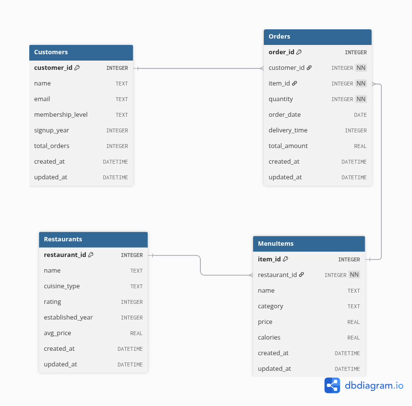

# Food Delivery Platform Database (SQLite and Faker)

This project demonstrates the creation and population of an **SQL database** for a **Food Delivery Platform**, built using **SQLite** and **Python’s Faker library**.  
It was developed as part of a data science assignment to showcase database design, data generation, and SQL manipulation skills.

---

## Learning Objectives

This project demonstrates:
- Knowledge and understanding of **SQL databases** using **SQLite** DB
- Methods to **extract and manipulate data**
- Understanding of **data types** — nominal, ordinal, interval and ratio
- Ability to **generate synthetic datasets** using Python and Faker
- Familiarity with **database schema design**, relationships, and constraints

---

## Database Schema

The database models a simple food delivery platform consisting of:
| Table           | Description                                                     |
| --------------- | --------------------------------------------------------------- |
| **Customers**   | Contains user info and membership levels (Bronze, Silver, Gold) |
| **Restaurants** | Stores restaurant details including cuisine type and ratings    |
| **MenuItems**   | Lists food items for each restaurant                            |
| **Orders**      | Records customer orders with item details and total amounts     |


The below **Entity Relationship Diagram** illustrates the relationships between the tables in the Food Delivery Platform database.



### Key Features
- Foreign key relationships between `Restaurants`, `MenuItems`, and `Orders`
- Data constraints (`CHECK`, `UNIQUE`, and `NOT NULL`)
- Automatic timestamps (`created_at`, `updated_at`)
- 1000+ rows of generated fake data

---

## Project Structure
```
    sql-database-project/
    ├─ README.md  #documetation
    ├─ erd.png  #entity relationship diagram
    ├─ data.db  #database file
    ├─ schema.sql  #DDL script to create DB tables
    ├─ generate_data.py  #python file to populate DB tables with fake data
    └─ script.sh  # the entrypoint script
```

---
## Project Requirement
- [**SQLite3**](https://sqlite.org/download.html)
- [**Python3**](https://www.python.org/)
- [**Git**](https://git-scm.com/)

---

## How to Run the Project
### Clone the repository
```bash
git clone https://github.com/adebisiabosede/sql-database-project.git
cd sql-database-project
```

### Run the setup script
```bash
chmod +x script.sh
./script.sh
```
---

## Author
**Abosede Racheal Adebisi** <__adebisiabosede08@gmail.com__>

